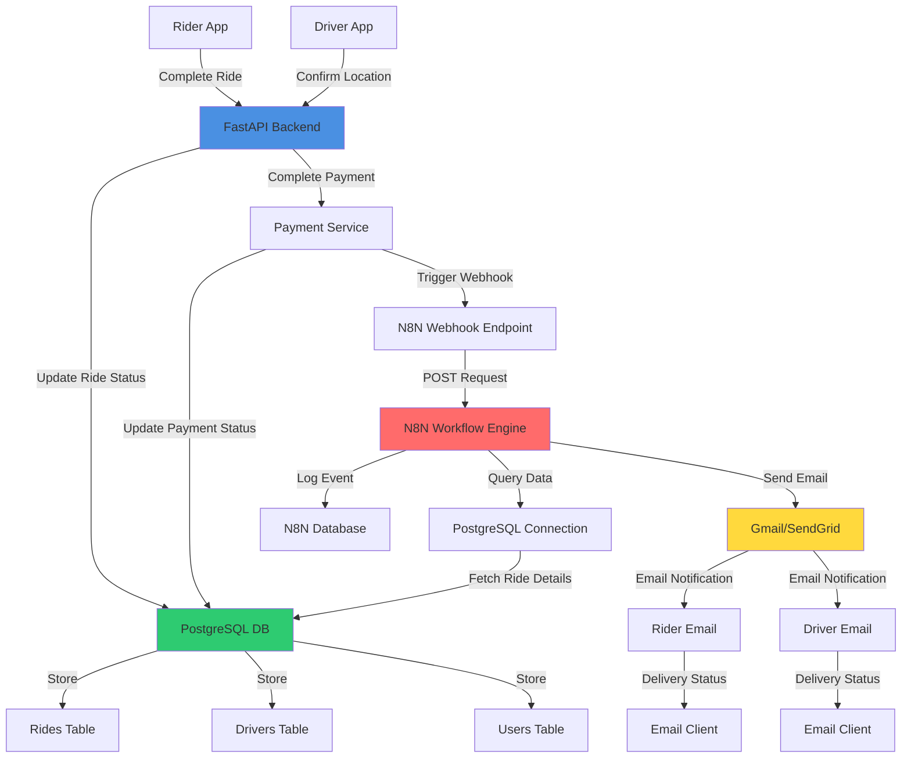
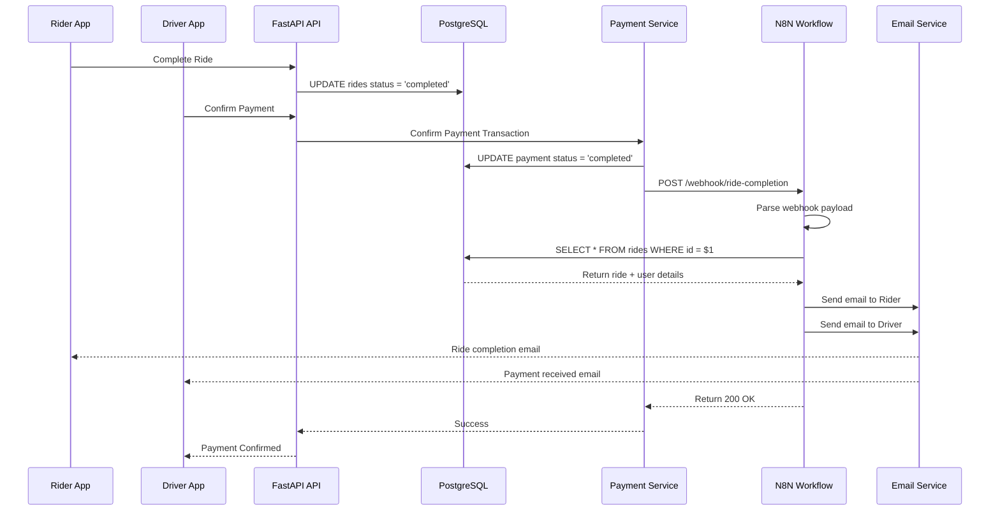
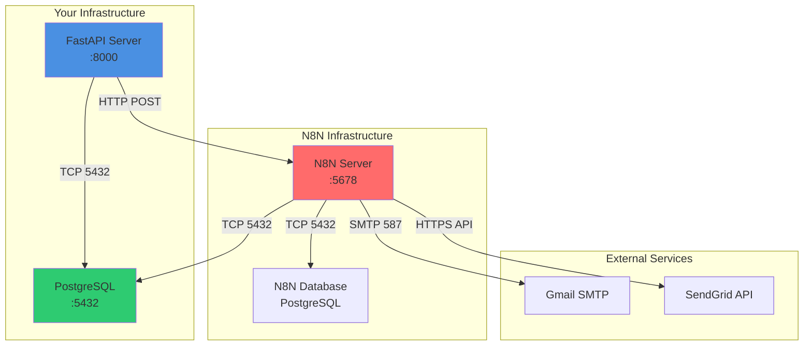
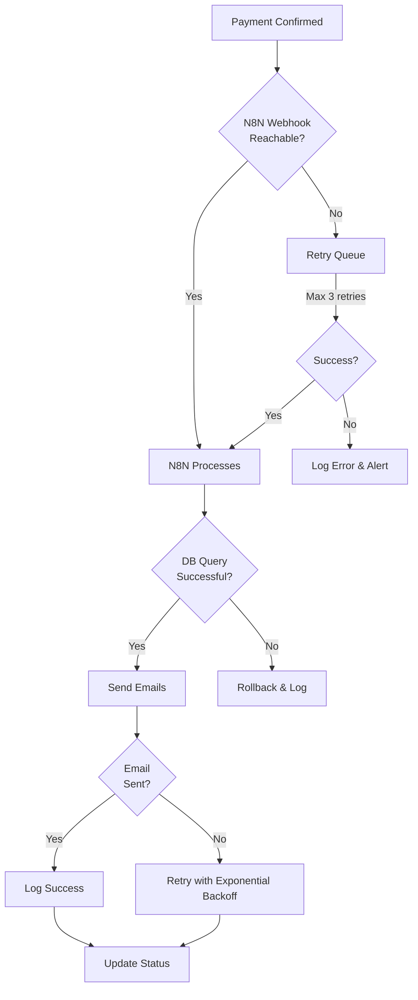

# N8N Integration Architecture

## Flow Diagram



## System Architecture


## Data Flow Sequence



## Component Communication

### 1. **Ride Completion Flow**
```
Rider marks ride complete
    ↓
FastAPI updates ride status → DB
    ↓
Driver confirms payment
    ↓
FastAPI confirm_payment endpoint
    ↓
Payment status → 'completed' in DB
    ↓
HTTP POST to N8N webhook
    ↓
N8N triggers workflow
```

### 2. **N8N Internal Flow**
```
Webhook Trigger (receives payload)
    ↓
PostgreSQL Node (queries ride details)
    ↓
Email Node 1 (sends to rider)
    ↓
Email Node 2 (sends to driver)
    ↓
Response Node (confirms success)
```

### 3. **Database Query Structure**
```
rides table
    ├─ id
    ├─ rider_id → users
    ├─ driver_id → drivers
    ├─ status ('completed')
    ├─ origin
    ├─ destination
    └─ fare
    
payments table
    ├─ id
    ├─ ride_id → rides
    ├─ status ('completed')
    └─ amount
    
users table
    ├─ id
    ├─ email
    └─ first_name
```

## Deployment Architecture



## Port Mapping

| Service | Port | Protocol | Purpose |
|---------|------|----------|---------|
| FastAPI | 8000 | HTTP | REST API server |
| PostgreSQL | 5432 | TCP | Database |
| N8N UI | 5678 | HTTP | Workflow editor |
| SMTP (Gmail) | 587 | SMTP | Email sending |
| SMTP (Gmail) | 465 | SMTPS | Email sending (TLS) |
| SendGrid | 443 | HTTPS | API calls |

## Security Boundaries

```
┌─────────────────────────────────────────────┐
│           Public Internet                    │
│   (Rider/Driver Apps, Email Clients)        │
└────────────────┬────────────────────────────┘
                 │ HTTPS
         ┌───────▼────────┐
         │  Your Firewall  │
         └───────┬────────┘
                 │ HTTP (Internal)
    ┌────────────┴──────────────┐
    │                           │
┌───▼────────┐          ┌──────▼───┐
│ FastAPI    │◄────────►│PostgreSQL │
│ :8000      │          │ :5432     │
└───┬────────┘          └───────────┘
    │ HTTP POST
    │ (to N8N)
    │
    │ ┌──────────────────────────────┐
    │ │  N8N Automation Layer        │
    │ │  (Can be separate server)    │
    │ │                              │
    └─►│ ├─ Workflow Engine          │
        │ ├─ PostgreSQL Connector    │
        │ ├─ Email Connector         │
        │ └─ Webhook Handler         │
        │                            │
        └───────────┬────────────────┘
                    │ SMTP/HTTPS
        ┌───────────▼──────────────┐
        │  External Services       │
        │ ├─ Gmail                 │
        │ ├─ SendGrid              │
        │ └─ Other APIs            │
        └──────────────────────────┘
```

## Error Handling & Retry Logic



## Monitoring Points

1. **N8N Workflow Logs**: Check execution history
2. **PostgreSQL Slow Queries**: Monitor query performance
3. **Email Delivery**: Track bounces & failures
4. **Webhook Latency**: Monitor response times
5. **Error Rates**: Alert on failures
